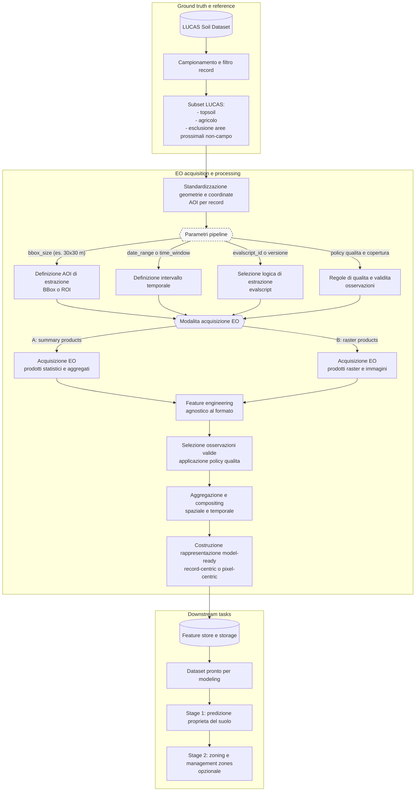

# 🌱 SCL-Only Evalscript Usage Guide

## 🎯 Purpose

This guide explains how to use the new `only_scl.js` evalscript to collect more Sentinel-2 data by relaxing filtering criteria while maintaining quality control through SCL (Scene Classification Layer) filtering.

## 📋 Background

The original `features.js` evalscript applies strict filtering:
- **SCL filtering**: Excludes clouds, shadows, water, snow/ice
- **Sun zenith angle < 70°**: Excludes high solar zenith angles
- **NDVI < 0.2**: Excludes vegetated areas
- **MNDWI < 0.0**: Excludes water bodies

This strict filtering resulted in low data availability, making it difficult to collect sufficient data for analysis.

## ✨ Solution: SCL-Only Filtering

The new `only_scl.js` evalscript removes the vegetation, water, and sun zenith filters, keeping only the essential SCL filtering:

### 🔍 What's Removed:
- ❌ Sun zenith angle filtering
- ❌ NDVI vegetation filtering
- ❌ MNDWI water filtering

### ✅ What's Kept:
- ✅ SCL filtering (clouds, shadows, water, snow/ice)
- ✅ Same 18 feature computation
- ✅ Same output format
- ✅ Compatible with existing analysis tools

## 🚀 Usage Instructions

### 1. Basic Command

```bash
python scaleway_batch_stats_from_xlsx.py \
  --xlsx gabri_filters.xlsx \
  --workers 3 \
  --evalscript_path statistics/evalscripts/only_scl.js \
  --start_date 2015-01-01 \
  --end_date 2018-12-31 \
  --storage_prefix batch_results_2015_2018_scl_only
```

### 2. Parameters Explained

| Parameter | Value | Description |
|-----------|-------|-------------|
| `--xlsx` | `gabri_filters.xlsx` | Input Excel file with point coordinates |
| `--workers` | `3` | Number of parallel workers (as requested for VM) |
| `--evalscript_path` | `statistics/evalscripts/only_scl.js` | Path to SCL-only evalscript |
| `--start_date` | `2015-01-01` | Start date (Sentinel-2 data availability) |
| `--end_date` | `2018-12-31` | End date |
| `--storage_prefix` | `batch_results_2015_2018_scl_only` | Storage prefix for results |

### 3. Expected Benefits

- **⬆️ Higher data availability**: More pixels will pass filtering
- **⬆️ Better temporal coverage**: More dates with valid data
- **⬆️ More comprehensive analysis**: Better statistical power
- **✅ Same quality control**: Still excludes problematic pixels via SCL

## 📊 Comparison: Strict vs. Relaxed Filtering

| Aspect | `features.js` (Strict) | `only_scl.js` (Relaxed) |
|--------|-----------------------|------------------------|
| **Filters** | SCL + sun zenith + NDVI + MNDWI | SCL only |
| **Data availability** | Lower | Higher |
| **Precision** | Higher (bare soil focus) | Lower (more diverse pixels) |
| **Temporal coverage** | Sparser | Denser |
| **Use case** | Final analysis, high-quality data | Initial exploration, maximum data |
| **Output format** | 18 features | 18 features (compatible) |

## 🔧 Advanced Options

You can still use additional filtering parameters if needed:

```bash
# Optional: Add additional filtering thresholds
python scaleway_batch_stats_from_xlsx.py \
  --xlsx gabri_filters.xlsx \
  --workers 3 \
  --evalscript_path statistics/evalscripts/only_scl.js \
  --start_date 2015-01-01 \
  --end_date 2018-12-31 \
  --storage_prefix batch_results_2015_2018_scl_only \
  --ndvi_threshold 0.5 \          # Optional: Relaxed vegetation filter
  --coverage_threshold 0.3        # Optional: Minimum coverage
```

## 📈 Analysis Workflow

1. **Data Collection**: Use `only_scl.js` for maximum data collection
2. **Initial Analysis**: Use `ResultsAnalyzer` to assess data quality and coverage
3. **Quality Filtering**: Apply additional filters in post-processing if needed
4. **Final Analysis**: Use `features.js` for high-precision final results

## 🎓 Recommendations

1. **Start with SCL-only**: Collect as much data as possible initially
2. **Analyze coverage**: Use the results analyzer to check data availability
3. **Refine filtering**: Add post-processing filters based on your analysis needs
4. **Compare results**: Run both evalscripts to understand the trade-offs

## 🔗 Related Files

- `statistics/evalscripts/only_scl.js` - SCL-only evalscript
- `statistics/evalscripts/features.js` - Strict filtering evalscript
- `scaleway_batch_stats_from_xlsx.py` - Batch processing script
- `statistics/analysis/results_analyzer.py` - Results analysis tool

## ✅ Success Criteria

- Higher data availability rate (>50% improvement expected)
- Better temporal coverage across all points
- Compatible output format for existing analysis tools
- Maintained data quality through SCL filtering


